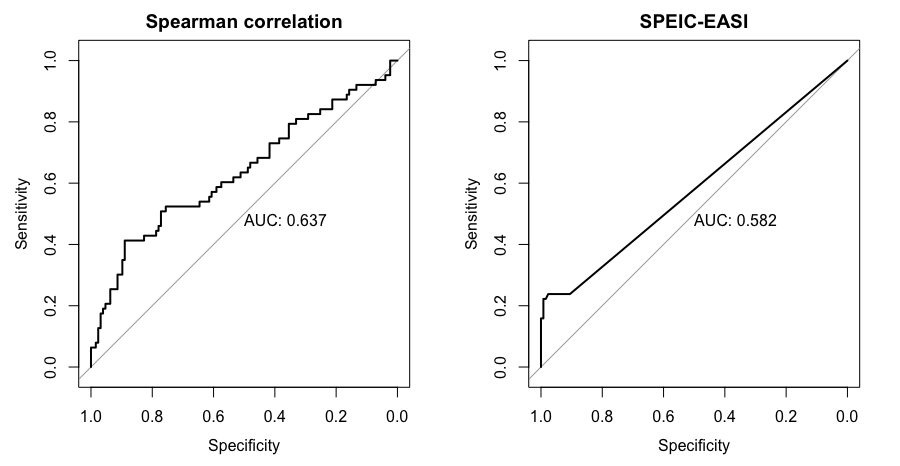
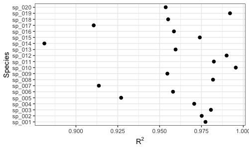
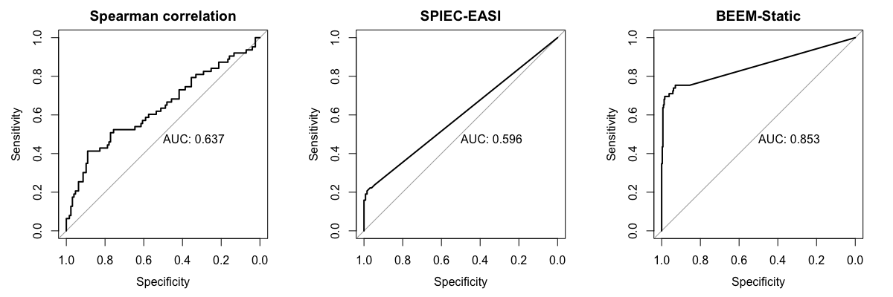
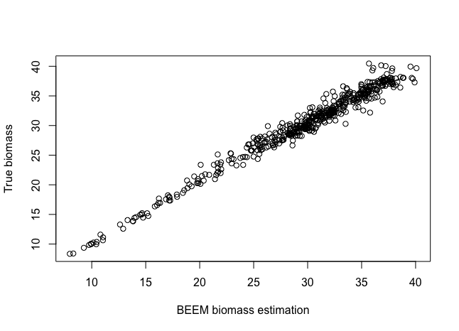

# BEEM-{Static}

## Description

BEEM-{Static} uses an Expectation Maximization (EM)-like alogirithm to estimate **total biomass values**, **growth rates** and **interactions** (generalized Lotka-Volterra parameters), as motivated by the core idea of the original [BEEM](https://github.com/lch14forever/BEEM) algorithm. BEEM-{static}, however, is designed to handle **cross-sectional** microbial profiling data with an assumption that a large fraction of the samples is at the steady state. 

**Note**: This package is under active development.

## Installation

```r
devtools::install('lch14forever/beem_static')
library(beemStatic)
```

## Example usage

### Simulated data

The demo dataset is a simulated community of 20 species and 500 samples. All of the samples are at the steady states (generated by numerically integrating the gLVM until convergence) and the species have 70% habitat preference (each sample contains 70% of all the species randomly). 

```r
data("beemDemo")
attach(beemDemo)

## Use `?beemDemo` to see the help of the fields in this dataset
```

### Correlations do not recapitulate interactions

We now run two popular methods for inferring microbial interactions from our simulated data. Both methods try to infer an association matrix as a proxy for the interaction matrix.

1. Using an naive Spearman's correlation method

```r
spearman <- cor(t(dat.w.noise), method='spearman')
```

2. Using [SPIEC-EASI](https://github.com/zdk123/SpiecEasi)
```r
## devtools::install_github("zdk123/SpiecEasi")
library(SpiecEasi)
se <- spiec.easi(t(dat.w.noise), method='mb')
se.stab <- as.matrix(getOptMerge(se))
```
#### ROC curves of interaction estimations

```r
par(mfrow=c(1,2))
auc.b(spearman, scaled.params$b.truth, is.association = TRUE, main='Spearman correlation')
auc.b(se.stab, scaled.params$b.truth, is.association = TRUE, main='SPIEC-EASI')
```




### Run BEEM-{Static}

```r
res <- func.EM(dat.w.noise, ncpu=4, scaling=median(biomass.true))
```

#### Investigating model fit

We can check the [coefficient of determination](https://en.wikipedia.org/wiki/Coefficient_of_determination) ($R^2$) for each species. A high $R2$ (close to 1) value indicates that the variation in the data is well explained by the model.

```r
diagnoseFit(res, dat.w.noise, annotate = FALSE)
```



#### Estimated parameters vs. true parameters
```r
est <- beem2param(res)
par(mfrow=c(1,2))
plot(est$a.est, scaled.params$a.truth, xlab='BEEM estimation', ylab='Truth', main='Growth rates')
auc.b(est$b.est, scaled.params$b.truth, main='Interaction matrix')
```



#### Estimated biomass vs. true biomass

```r
plot(res$trace.m[,30], biomass.true, xlab='BEEM biomass estimation', ylab='True biomass')
```



## Citation

A manuscript for BEEM-{Static} is in preparation and please cite BEEM if you use this package:

 - C Li, et al. (2018) An expectation-maximization-like algorithm enables accurate ecological modeling using longitudinal metagenome sequencing data. [BioRxiv](https://www.biorxiv.org/content/early/2018/07/17/288803)
